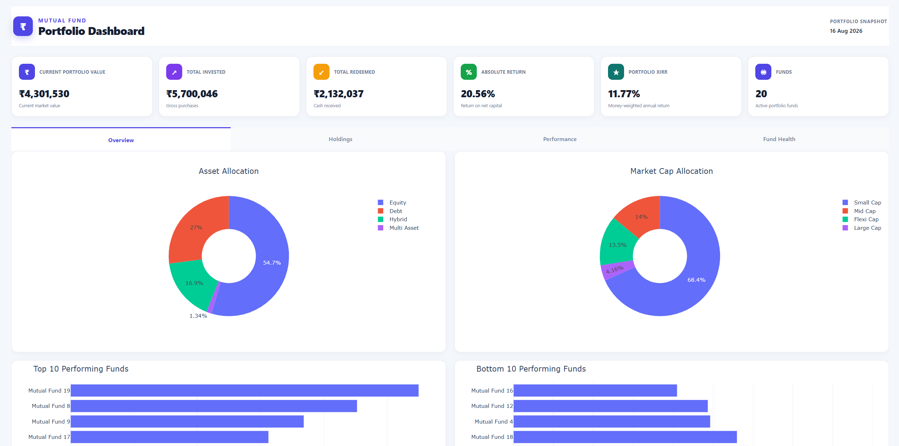
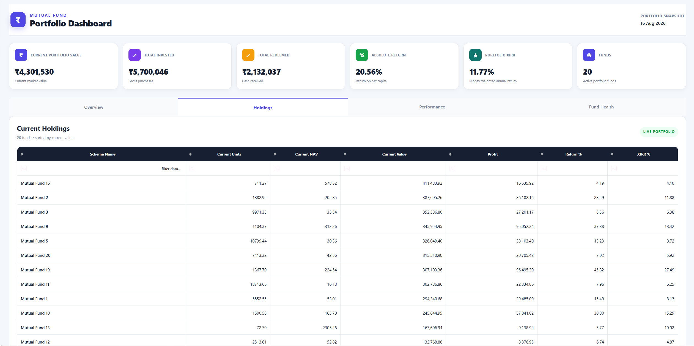
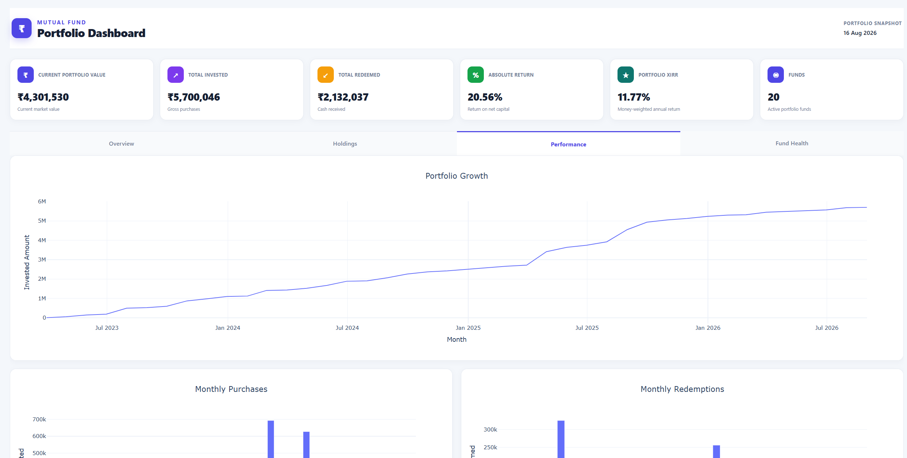
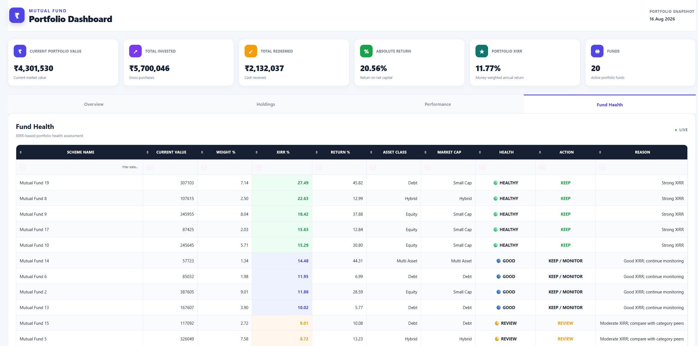

# Mutual Fund Portfolio Analytics Dashboard

An interactive mutual fund portfolio analytics dashboard built with **Python, Pandas, Plotly and Dash**.

The application processes mutual fund transaction data from Excel and converts it into an interactive portfolio analytics dashboard covering holdings, performance, returns, XIRR, asset allocation and fund health.

---

## Dashboard Preview

### Portfolio Overview



### Holdings



### Performance



### Fund Health



---

## Key Features

### Portfolio Analytics

- Portfolio overview and key performance indicators
- Current portfolio holdings
- Current portfolio value
- Profit / loss analysis
- Portfolio return analysis
- Portfolio performance visualization

### Transaction Analytics

- Purchase transaction tracking
- Redemption transaction tracking
- Transaction-level analysis
- Current holdings calculated from transaction history

### Return Analysis

- Fund-level XIRR calculation
- Portfolio-level return analysis
- Historical investment and redemption analysis
- Profit and return percentage calculations

### Portfolio Allocation

- Asset allocation
- Market-cap allocation
- AMC-level analysis
- Fund-level allocation analysis

### Fund Health

- Fund performance comparison
- XIRR-based fund analysis
- Top and bottom performing funds
- Interactive fund-level analytics

### Interactive Dashboard

- Interactive tables
- Sorting
- Filtering
- Pagination
- Dynamic charts
- Multiple analytical dashboard tabs

---

## Technology Stack

- **Python**
- **Pandas**
- **NumPy**
- **SciPy**
- **Plotly**
- **Dash**
- **Dash Bootstrap Components**
- **OpenPyXL**
- **Microsoft Excel**

---

## Data

The project uses an **anonymized sample mutual fund transaction dataset**.

The sample data is intended only to demonstrate the functionality of the dashboard and does not contain personal portfolio information.

The transaction workbook contains:

- Purchase transactions
- Redemption transactions
- NAV information
- Transaction dates
- Units
- Current NAV and holdings information

Fund names have been anonymized as:

`Mutual Fund 1`, `Mutual Fund 2`, `Mutual Fund 3`, etc.

---

## Project Structure

```text
Mutual-Fund-Portfolio-Dashboard/
│
├── dashboard.py
├── sample_transactions.xlsx
├── requirements.txt
├── README.md
├── .gitignore
│
└── assets/
    └── screenshots/
        ├── overview.png
        ├── holdings.png
        ├── performance.png
        └── fund_health.png
